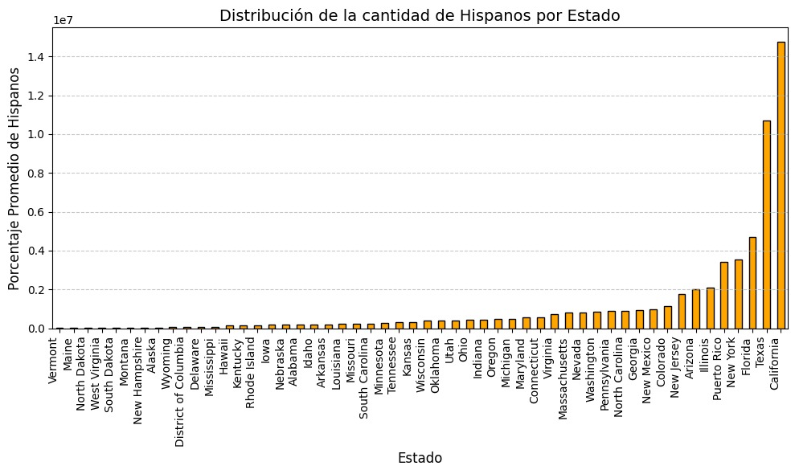
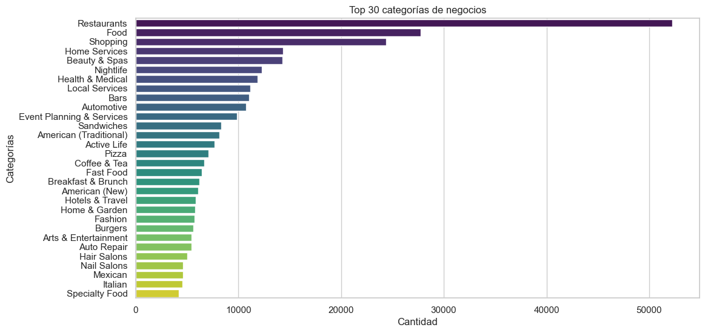
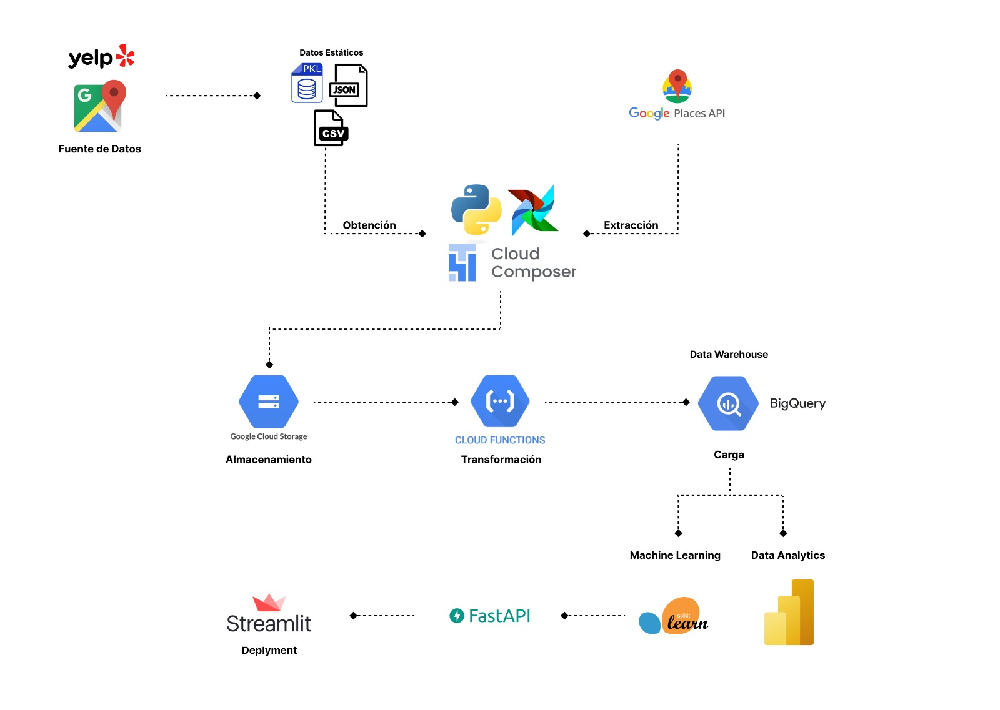

# <h1 align="center">**YELP & GOOGLE MAPS**</h1>

## <h1 align="center">**`DataPionner Consulting`**</h1>

<div align="center">
  
</div>

# <h2 align=center> Nombre del Proyecto:</h2>
<h2 align=center>Análisis del Mercado de Restaurantes Latinos en USA</h2>

## ```Contexto```
La población latina es uno de los grupos de mayor crecimiento en los Estados Unidos, representando un 18.9% de la población total. Este segmento, diverso en nacionalidades y culturas, ha transformado significativamente la gastronomía estadounidense, posicionando la comida latina como una de las más populares. Sin embargo, el mercado no está totalmente explotado y presenta oportunidades estratégicas para nuevos negocios.

<p align="center"> Gráfico 1: Población Latina por Estado </p>

<div align="center">
  
</div>

## ```Nuestro Cliente```
El cliente es un inversor latinoamericano propietario de una exitosa cadena de restaurantes en su país de origen. Ahora busca expandirse al mercado estadounidense con una propuesta culinaria auténtica y adaptada, que combine platos tradicionales latinos con un enfoque en los gustos locales. El objetivo del cliente es posicionar su marca como un referente de la gastronomía latina en Estados Unidos, apelando tanto a la comunidad latina como a consumidores interesados en experiencias gastronómicas únicas.

<p align="center"> Gráfico 2: Identificación del Sector Clave para el Análisis </p>

<div align="center">
  
</div>


## ```Objetivo General del Proyecto```
Diseñar una estrategia basada en datos para maximizar el éxito de la expansión.

### Objetivos Específicos
1. Análisis de ubicación: Identificar las mejores ciudades y estados.
2. Personalización de la oferta: Diseñar menús y experiencias adaptadas.
3. Modelo de predicción: Estimar el rendimiento de cada ubicación.

## ```Alcance del Proyecto```

El alcance del proyecto consiste en realizar un análisis exhaustivo de datos para optimizar la expansión del negocio de comida latina de nuestro  cliente. Esto implica identificar las mejores ubicaciones para abrir nuevos restaurantes, diseñando menús y experiencias personalizadas para los Estados que tienen influencia de la población hispana, y desarrollando un modelo predictivo que permita estimar el éxito de apertura. En resumen, buscamos utilizar la ciencia de datos para tomar decisiones estratégicas y maximizar el rendimiento de tu inversión en expansión.

## ```Metodología de Trabajo```

La metodología SCRUM, se ha empleado para realizar el proyecto, debido a que enfatiza la colaboración, la adaptación y la entrega incremental del producto solicitado por el cliente. 

Para el Primer Sprint, se ha realizado:

- Trabajo Inicial: Definición del problema, recopilación de datos y exploración inicial.
- Planificación de Sprint: Establecimiento de objetivos claros y tareas específicas para un período determinado (sprint).
- Daily Scrum: Reunión diaria breve para sincronizar el trabajo y resolver impedimentos.
- Trabajo Diario: Desarrollo de las tareas asignadas en el sprint.
- Actualización del Backlog: Ajustar las prioridades y tareas pendientes en función de los avances y nuevos conocimientos.
- Retrospectiva de Sprint: Reflexionar sobre lo que funcionó bien, lo que no y cómo mejorar en el próximo sprint.
- Release: Entrega de tarea asignada.

## ```Fuente de Datos```
Yelp: Información sobre negocios, reseñas de usuarios, categorías de negocios y ubicaciones.

Google: Datos relacionados con búsquedas y tendencias de población.

## ```Desarrollo del Proyecto```

Este primer sprint se enfoca en:

- Extracción, transformación y carga (ETL) de los datos de Yelp y Google relacionados con negocios y usuarios.
- Análisis exploratorio de datos (EDA) para generar insights clave que guíen las siguientes etapas.
- Identificación preliminar de ubicaciones y categorías relevantes para la expansión.

## ```KPI's```
- Tasa de Conversión de Reseñas Positivas.
    - Qué analiza: Satisfacción del cliente en restaurantes latinos.
    - Fórmula: (Reseñas con puntuación ≥ 4 / Total de reseñas) * 100
    - Objetivo: Identificar ubicaciones con alta aceptación.
    - Aporte: Replicar prácticas exitosas en nuevas aperturas.

- Índice de Penetración en el Mercado.
    - Qué analiza: Proporción de restaurantes latinos en relación al total.
    - Fórmula: (Cantidad de restaurantes latinos / Total de restaurantes) * 100
    - Objetivo: Detectar áreas con baja saturación.
    - Aporte: Elegir ubicaciones con menor competencia.

- Aceptación General de la Cocina Latina.
    - Qué analiza: Proporción de reseñas sobre restaurantes latinos.
    - Fórmula: (Reseñas de restaurantes latinos / Total de reseñas) * 100
    - Objetivo: Evaluar aceptación de la cocina latina por región.
    - Aporte: Priorizar regiones con alta demanda.

## ```Stack Tecnológico```

- **Lenguajes y Librerías:**

Python (pandas, numpy, matplotlib, seaborn, Scikit-Learn)

- **Infraestructura:**

Google Cloud Platform (GCP) para almacenamiento y procesamiento en la nube.

- **Herramientas de Análisis y Visualización:**

Jupyter Notebooks
BigQuery (para consultas estructuradas y análisis avanzado)
Tableau/PowerBI: Dashboards interactivos.

- **Herramientas Adicionales:**

Streamlit y FastAPI: Despliegue de soluciones interactivas.
GitHub: Herramientas para colaboración.

<p align="center"> Gráfico 3: Pipeline de Procesamiento de Datos </p>

<div align="center">
  
</div>


## ```Equipo de Trabajo```

<div align="center">
  
</div>
