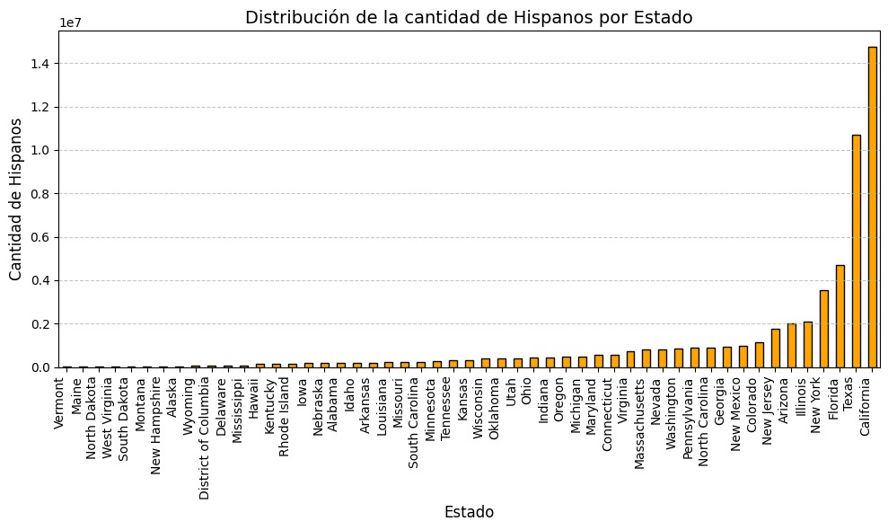
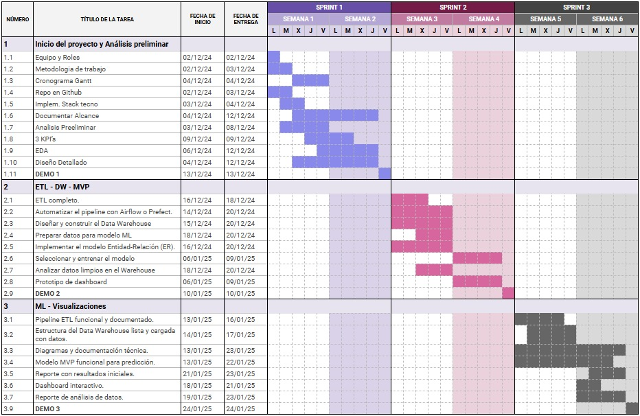

# <h1 align="center">**YELP & GOOGLE MAPS**</h1>

## <h1 align="center">**`DataPioneer Consulting`**</h1>

<div align="center">
  
</div>

# <h2 align=center> Nombre del Proyecto:</h2>
<h2 align=center>Análisis del Mercado de Restaurantes Latinos en USA</h2>

## ```Contexto```
La población latina es uno de los grupos de mayor crecimiento en los Estados Unidos, representando un 18.9% de la población total. Este segmento, diverso en nacionalidades y culturas, ha transformado significativamente la gastronomía estadounidense, posicionando la comida latina como una de las más populares. Sin embargo, el mercado no está totalmente explotado y presenta oportunidades estratégicas para nuevos negocios.

<p align="center"> Gráfico 1: Población Latina por Estado </p>

<div align="center">
  
</div>

## ```Nuestro Cliente```
El cliente es un inversor latinoamericano propietario de una exitosa cadena de restaurantes en su país de origen. Ahora busca expandirse al mercado estadounidense con una propuesta culinaria auténtica y adaptada, que combine platos tradicionales latinos con un enfoque en los gustos locales. El objetivo del cliente es posicionar su marca como un referente de la gastronomía latina en Estados Unidos, apelando tanto a la comunidad latina como a consumidores interesados en experiencias gastronómicas únicas.

<p align="center"> Gráfico 2: Identificación del Sector Clave para el Análisis </p>

<div align="center">
  
</div>


## ```Objetivo General del Proyecto```
Diseñar una estrategia basada en datos para maximizar el éxito de la expansión.

### Objetivos Específicos
1. Análisis de ubicación: Identificar las mejores ciudades y estados.
2. Personalización de la oferta: Diseñar menús y experiencias adaptadas.
3. Modelo de predicción: Estimar el rendimiento de cada ubicación.

## ```Alcance del Proyecto```

El alcance del proyecto consiste en realizar un análisis exhaustivo de datos para optimizar la expansión del negocio de comida latina de nuestro  cliente. Esto implica identificar las mejores ubicaciones para abrir nuevos restaurantes, diseñando menús y experiencias personalizadas para los Estados que tienen influencia de la población hispana, y desarrollando un modelo predictivo que permita estimar el éxito de apertura. En resumen, buscamos utilizar la ciencia de datos para tomar decisiones estratégicas y maximizar el rendimiento de tu inversión en expansión.

## ```Metodología de Trabajo```

Para garantizar la entrega ágil y adaptada a las necesidades del cliente, hemos adoptado la metodología Scrum. Este marco de trabajo se basa en la colaboración continua y la entrega incremental de valor a través de Sprints.
En este proyecto, hemos planificado tres Sprints:

- Sprint 1: Definición del problema, objetivos, roles y análisis preliminar de datos.
- Sprint 2: Implementación del proceso ETL, diseño del Data Warehouse y desarrollo del Producto Mínimo Viable (MVP).
- Sprint 3: Desarrollo del modelo de Machine Learning, creación de un dashboard interactivo y generación de la documentación final.

Para una mejor visualización del progreso, hemos elaborado el siguiente cronograma:

<p align="center"> Gráfico 3: Cronograma </p>

<div align="center">
  
</div>


## ```Fuente de Datos```
Yelp: Información sobre negocios, reseñas de usuarios, categorías de negocios y ubicaciones.

Google: Datos relacionados con búsquedas y tendencias de población.

## ```Desarrollo del Proyecto```

Este primer sprint se enfoca en:

- Extracción, transformación y carga (ETL) de los datos de Yelp y Google relacionados con negocios y usuarios.
- Análisis exploratorio de datos (EDA) para generar insights clave que guíen las siguientes etapas.
- Identificación preliminar de ubicaciones y categorías relevantes para la expansión.

## ```KPI's```
- Tasa de Conversión de Reseñas Positivas.
    - Qué analiza: Satisfacción del cliente en restaurantes latinos.
    - Fórmula: (Reseñas con puntuación ≥ 4 / Total de reseñas) * 100
    - Objetivo: Identificar ubicaciones con alta aceptación.
    - Aporte: Replicar prácticas exitosas en nuevas aperturas.

- Índice de Penetración en el Mercado.
    - Qué analiza: Proporción de restaurantes latinos en relación al total.
    - Fórmula: (Cantidad de restaurantes latinos / Total de restaurantes) * 100
    - Objetivo: Detectar áreas con baja saturación.
    - Aporte: Elegir ubicaciones con menor competencia.

- Aceptación General de la Cocina Latina.
    - Qué analiza: Proporción de reseñas sobre restaurantes latinos.
    - Fórmula: (Reseñas de restaurantes latinos / Total de reseñas) * 100
    - Objetivo: Evaluar aceptación de la cocina latina por región.
    - Aporte: Priorizar regiones con alta demanda.

## ```Stack Tecnológico```

- **Lenguajes y Librerías:**

Python (pandas, numpy, matplotlib, seaborn, Scikit-Learn)

- **Infraestructura:**

Google Cloud Platform (GCP) para almacenamiento y procesamiento en la nube.

- **Herramientas de Análisis y Visualización:**

Jupyter Notebooks
BigQuery (para consultas estructuradas y análisis avanzado)
Tableau/PowerBI: Dashboards interactivos.

- **Herramientas Adicionales:**

Streamlit y FastAPI: Despliegue de soluciones interactivas.
GitHub: Herramientas para colaboración.

<p align="center"> Gráfico 4: Pipeline de Procesamiento de Datos </p>

<div align="center">
  
</div>


## ```Equipo de Trabajo```

<div style="background-color: #111; color: #fff; padding: 40px; font-family: Arial, sans-serif; text-align: center;">
  <h2 style="margin-bottom: 50px;">CONOCE AL EQUIPO</h2>
  <div style="display: flex; justify-content: center; gap: 20px; flex-wrap: wrap;">
    <!-- Integrante 1 -->
    <div style="background-color: #222; padding: 20px; border-radius: 10px; width: 200px; text-align: center;">
      <a href="https://www.linkedin.com/in/gustavo-gonzalez-data/" target="_blank" style="text-decoration: none; color: inherit;">
        
        <p style="margin-top: 15px; font-size: 18px; font-weight: bold;">Gustavo Gonzalez</p>
        <p style="margin-top: 5px; font-size: 14px; color: #ccc;">Data Engineer</p>
      </a>
    </div>
    <!-- Integrante 2 -->
    <div style="background-color: #222; padding: 20px; border-radius: 10px; width: 200px; text-align: center;">
      <a href="https://www.linkedin.com/in/marianaballardini/" target="_blank" style="text-decoration: none; color: inherit;">
        
        <p style="margin-top: 15px; font-size: 18px; font-weight: bold;">Mariana Ballardini</p>
        <p style="margin-top: 5px; font-size: 14px; color: #ccc;">Data Engineer</p>
      </a>
    </div>
    <!-- Integrante 3 -->
    <div style="background-color: #222; padding: 20px; border-radius: 10px; width: 200px; text-align: center;">
      <a href="https://www.linkedin.com/in/jossy-romero-data/" target="_blank" style="text-decoration: none; color: inherit;">
        
        <p style="margin-top: 15px; font-size: 18px; font-weight: bold;">Jossy Romero</p>
        <p style="margin-top: 5px; font-size: 14px; color: #ccc;">Data Scientist</p>
      </a>
    </div>
    <!-- Integrante 4 -->
    <div style="background-color: #222; padding: 20px; border-radius: 10px; width: 200px; text-align: center;">
      <a href="https://www.linkedin.com/in/valentin-salgado-463332301/" target="_blank" style="text-decoration: none; color: inherit;">
        
        <p style="margin-top: 15px; font-size: 18px; font-weight: bold;">Valentin Salgado</p>
        <p style="margin-top: 5px; font-size: 14px; color: #ccc;">Data Analyst</p>
      </a>
    </div>
    <!-- Integrante 5 -->
    <div style="background-color: #222; padding: 20px; border-radius: 10px; width: 200px; text-align: center;">
      <a href="https://www.linkedin.com/in/juan-veller/" target="_blank" style="text-decoration: none; color: inherit;">
        
        <p style="margin-top: 15px; font-size: 18px; font-weight: bold;">Juan Veller</p>
        <p style="margin-top: 5px; font-size: 14px; color: #ccc;">Data Analyst</p>
      </a>
    </div>
  </div>
  <p style="margin-top: 40px; font-size: 16px; color: #888;">UN EQUIPO DEDICADO A TRANSFORMAR DATOS EN DECISIONES ESTRATÉGICAS.</p>
</div>
